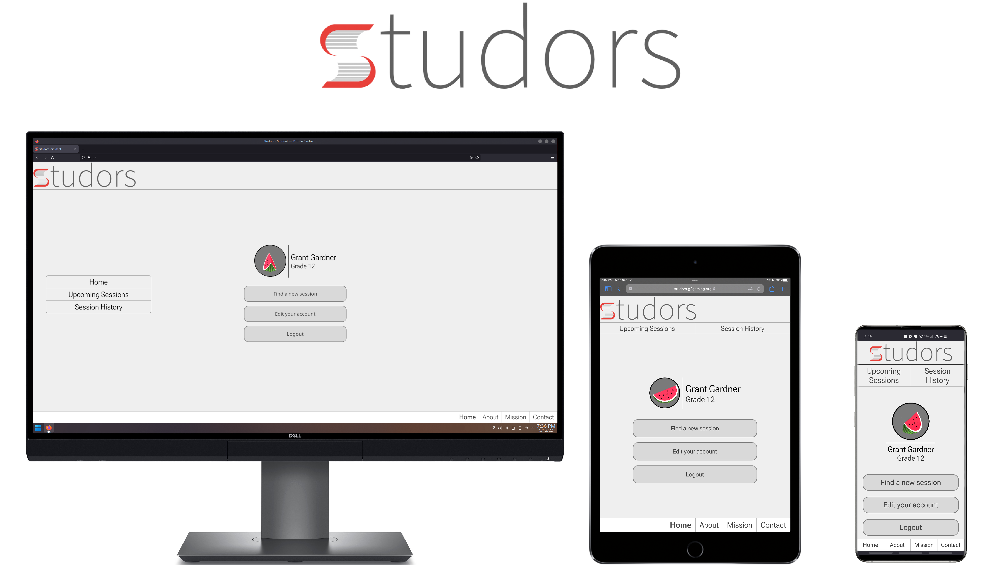

# Studors

A web service that allows for students to get in contact with volunteer student tutors

Developed by Blaine Traudt

Designed by Grant Gardner

Logo by Louis Quattrocchi under the CC BY-NC 3.0 License

## TODO:

- [x] Form regex is broken
- [x] Ensure lowercase emails are consistent
- [x] Add space in with comma separation support (for batch email additions in admin panel)
- [x] Fix DB functions for new structure
- [x] Handle phone numbers better
- [x] Extra admin actions (e.g. add holidays)
- [x] Implement subjects and subject matching
- [x] Add proper matching
- [ ] Add unavailability options
- [ ] Make admin placeholders have current data instead of example
- [ ] Test suite from start to finish
- [ ] Refactor all code and ensure proper function use and proper security
- [ ] Write pages

## KNOWN ISSUES:

When scheduling a session the time used is the user's browser time instead of the servers time leading to possible confusion

Error handling in db.ts is _possibly_ broken

### WEB PAGES NOT DONE:

/admin/manage // Light styling required

/admin/list // Styling required

/admin/settings // Convert to dialog?

/about // Done but waiting for info

/contact // Done but waiting for info

/mission // Done but waiting for info

/student/find // Styling required

/student/history

/student/request?

/student/settings // Convert to dialog?

/student/upcoming

/tutor/availability // Styling required

/tutor/subjects // Styling required

/tutor/history

/tutor/request

/tutor/settings // Convert to dialog?

/tutor/upcoming
